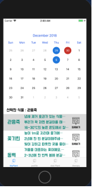
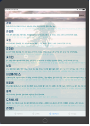

# Y_Admin
1) Google Login

메인 화면에서 Google로고와 Sign in이 적혀있는 버튼을 클릭하면 구글 로그인을 사용할 것인가 동의를 구하는 alart창이 뜬 후에 구글로 로그인을 하는 웹 페이지가 나온다. 여기서 사용자가 원래 사용하는 구글 계정과 비밀번호를 입력하면 우리 프로젝트의 database에 정보가 저장되며, 가입이 완료된다. 한번 로그인을 하면, 로그아웃 후에 버튼 한번 클릭으로 다시 로그인 가능하다.

.png)
<사용자 로그인 및 회원가입>
2) 식물 물주기 확인 Page
로그인 후에 가장 처음으로 나오는 화면이다. 이 화면 상단에는 캘린더가 있으며, 여기서 식물에게 언제 물을 줬는지, 최근에 물을 준 날짜를 체크한다. 그러면 자동으로 나중에 물을 줘야하는 날짜가 캘린더에 표시된다. 사용자가 한번 체크하면, 후에는 자동으로 체크가 되므로, 캘린더에 손을 대지 않아도 된다. 
캘린더 하단에 있는 Label은 하단 table view에서 사용자가 어떤 식물을 선택했는지 표시해 준다. tabelview에는 식물이름, 식물 설명, 상세보기버튼이 있으며, 상세보기 버튼을 누르면 상세 식물 설명 페이지로 이동한다.

 
<내 식물 및 물주기 확인> 
3) 사용자 정보 확인 Page
이 페이지에서는 사용자의 이름과 사진이 보여진다. 프로필 사진 좌측의 Setting을 누르면, 제작자가 나온다. 우측의 logout을 클릭하면 로그아웃 된다. 후에 이 페이지 배경 사진으로 식물의 위치를 표시하기 위한 지도를 넣을 예정이다.
 

4) 식물 정보 확인 및 선택 Page
3번째 tabbar를 누르면, 식물정보를 확인 할 수 있다.table에는 식물도감에 저장되어있는 식물들이 나온다. 글씨체는 배달의 민족에서 무료로 배포하는 폰트를 이용하였다. tableview에서 식물이름, 식물설명을 확인할 수 있다. 또한 search버튼으로 자신이 찾고자 하는 식물을 빠르게 찾을 수 있다. 이 식물 목록들은 선택할 수 있으며, 선택시 상세 페이지로 이동한다. 상세 페이지에서는 이 식물을 기를 수 있는 버튼을 눌러 자신의 식물로 등록한다. 또한 평가하기 버튼으로 이 식물을 평가 할 수 있다.
 
<식물 정보 확인 및 선택 page>      
 
<쉐폴레라 검색시 화면>     
.png) 
<cell선택시 화면>

5) 원예 테라피
원예 테라피 페이지는 tabbar의 4번째 아이콘을 누르면 나오는 화면이다. 각 버튼을 누르면, 식물 생육에 필요한 것, 원예에 필요한 도구, 식물을 선택하는 방법에 관하여 서술한 텍스트가 보여진다.

 
<원예테라피 화면>

6)  앱 최종 심사 마무리 

 
<앱 스토어 출시>

앞으로 기능을 추가적으로 제작하여 지속적인 업데이트를 할 것이다. 그래서 사용자가 식물을 반려 개념으로 인지 할 수 있도록 앱의 활용도를 높일 것이다.

